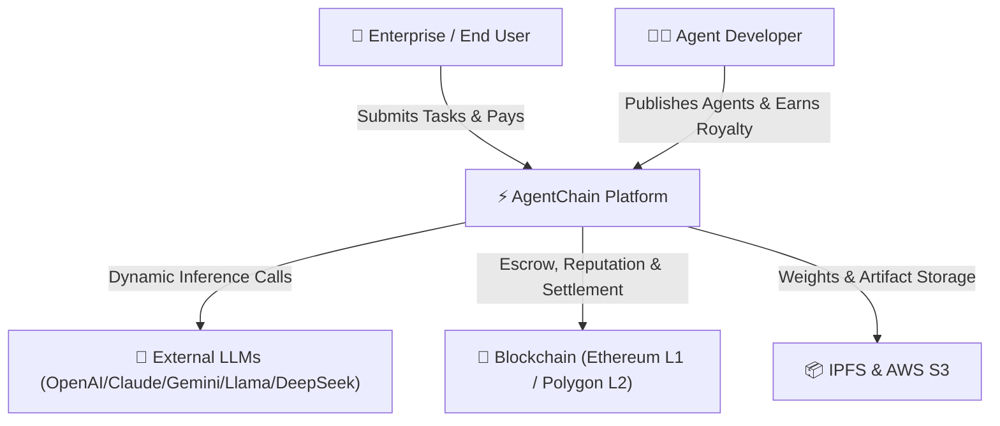
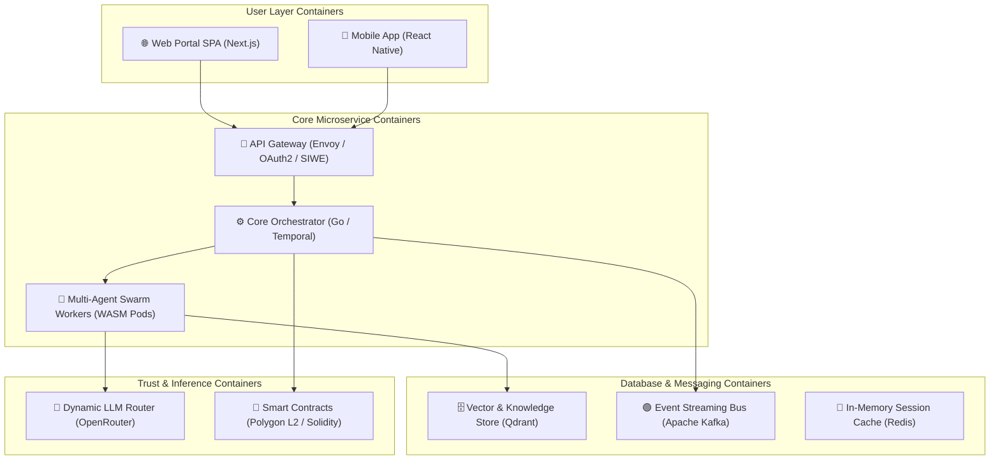
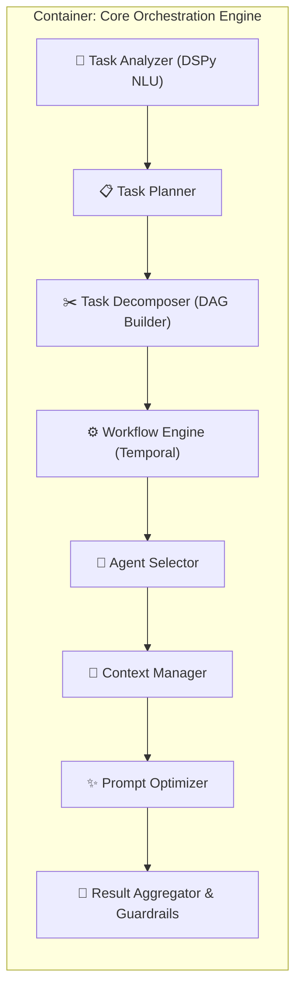
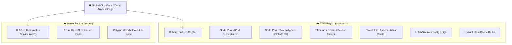
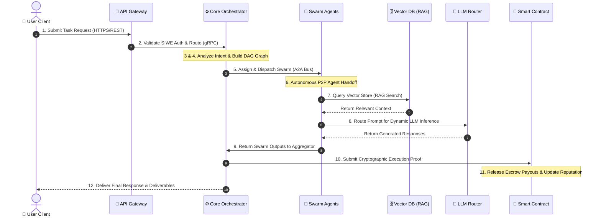
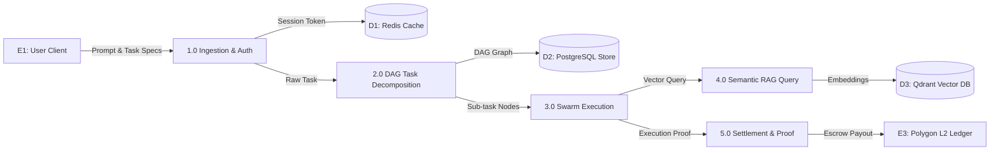
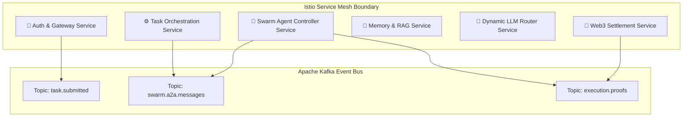
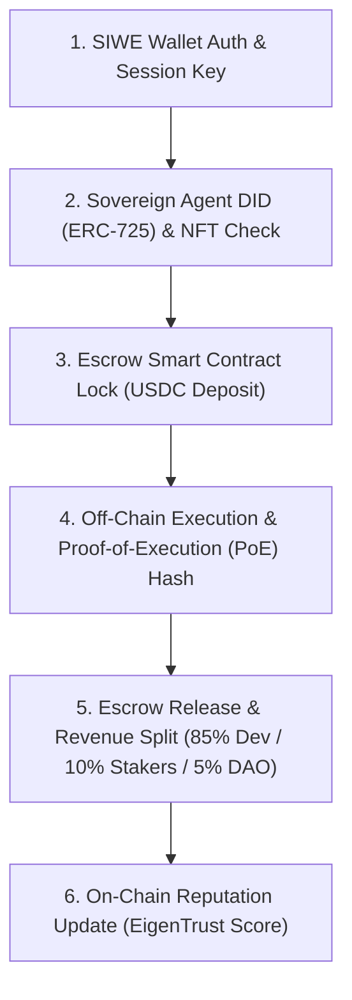
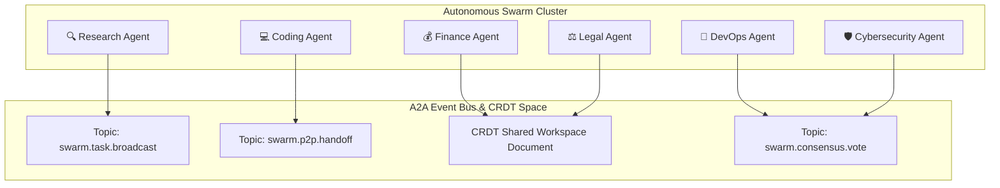
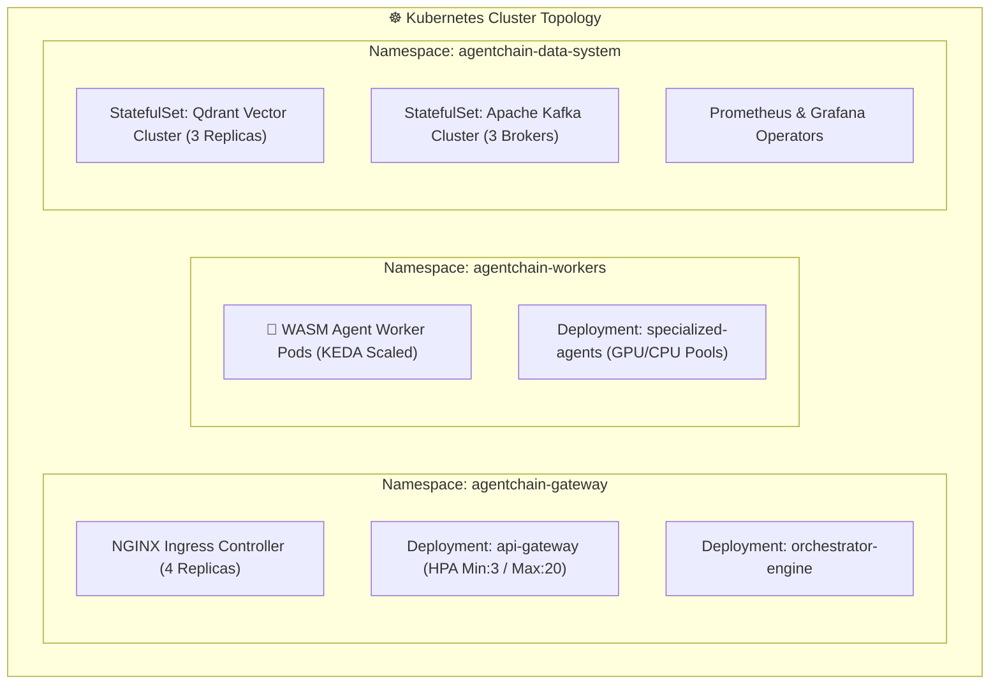

# AgentChain: 10 Specialized Architecture Diagrams & Technical Specifications

> **System Overview**: Specialized architectural views for **AgentChain: A Decentralized Autonomous AI Workforce Platform**. All 10 diagrams are fully aligned with the core 8-layer vertical enterprise architecture design pattern.

---

## Diagram Index & Vector SVG Links

1. **C4 Context Diagram**: [diagrams/c4_context.svg](file:///Users/shravani/Documents/AgentChain/diagrams/c4_context.svg)
2. **C4 Container Diagram**: [diagrams/c4_container.svg](file:///Users/shravani/Documents/AgentChain/diagrams/c4_container.svg)
3. **C4 Component Diagram**: [diagrams/c4_component.svg](file:///Users/shravani/Documents/AgentChain/diagrams/c4_component.svg)
4. **Deployment Diagram**: [diagrams/deployment.svg](file:///Users/shravani/Documents/AgentChain/diagrams/deployment.svg)
5. **Sequence Diagram**: [diagrams/sequence.svg](file:///Users/shravani/Documents/AgentChain/diagrams/sequence.svg)
6. **Data Flow Diagram (DFD)**: [diagrams/data_flow.svg](file:///Users/shravani/Documents/AgentChain/diagrams/data_flow.svg)
7. **Microservice Architecture**: [diagrams/microservices.svg](file:///Users/shravani/Documents/AgentChain/diagrams/microservices.svg)
8. **Blockchain Transaction Flow**: [diagrams/blockchain_flow.svg](file:///Users/shravani/Documents/AgentChain/diagrams/blockchain_flow.svg)
9. **AI Agent Collaboration Flow**: [diagrams/agent_collaboration.svg](file:///Users/shravani/Documents/AgentChain/diagrams/agent_collaboration.svg)
10. **Kubernetes Deployment Architecture**: [diagrams/k8s_architecture.svg](file:///Users/shravani/Documents/AgentChain/diagrams/k8s_architecture.svg)

---

## 1. C4 Context Diagram

Defines the system boundary of AgentChain, highlighting end users, developers, external LLM providers, blockchain networks, and decentralized storage.

---

## 2. C4 Container Diagram

Illustrates the high-level runnable containers composing AgentChain: Web/Mobile SPAs, API Gateway, Orchestration Services, WASM Swarm Workers, Qdrant Vector DB, LLM Router, Kafka, and Smart Contracts.

---

## 3. C4 Component Diagram (Core Orchestration Engine)

Zoomed-in micro-architecture of the **Core Orchestration Engine**, detailing internal software components.

---

## 4. Deployment Diagram (AWS & Azure Hybrid Cloud)

Multi-cloud deployment topology across AWS (us-east-1), Azure (eastus), and Web3 Polygon RPC Nodes.

---

## 5. Sequence Diagram (12-Step Task Lifecycle)

UML sequence trace detailing synchronous and asynchronous data flows across the system.

---

## 6. Data Flow Diagram (DFD Level 1/2)

Data movement across processes, external entities, and persistent data stores.

---

## 7. Microservice Architecture Diagram

Decoupled service mesh topology with Envoy sidecars, gRPC endpoints, and Kafka event streaming topics.

---

## 8. Blockchain Transaction Flow

Complete Web3 transaction flow: SIWE authentication, ERC-725 DID resolution, escrow deposits, Proof-of-Execution, revenue splits, and reputation updates.

---

## 9. AI Agent Collaboration Flow (A2A Protocol)

Peer-to-peer inter-agent messaging, shared workspace CRDT synchronization, sub-task handoffs, and swarm consensus voting.

---

## 10. Kubernetes Deployment Architecture

K8s cluster topology: Ingress NGINX, HPA/KEDA Pod Autoscalers, Agent Worker Pods, StatefulSets for Vector DB and Kafka, and Prometheus monitoring operators.

